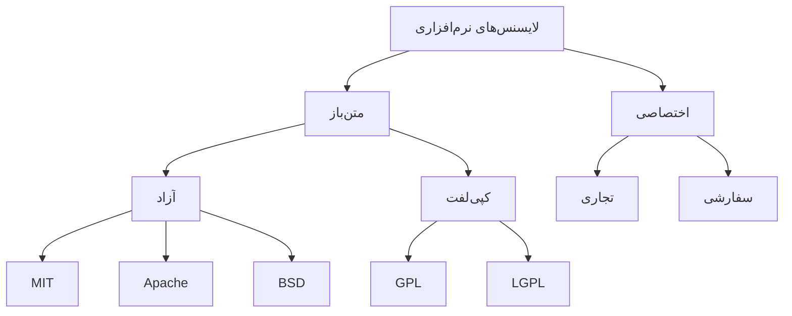
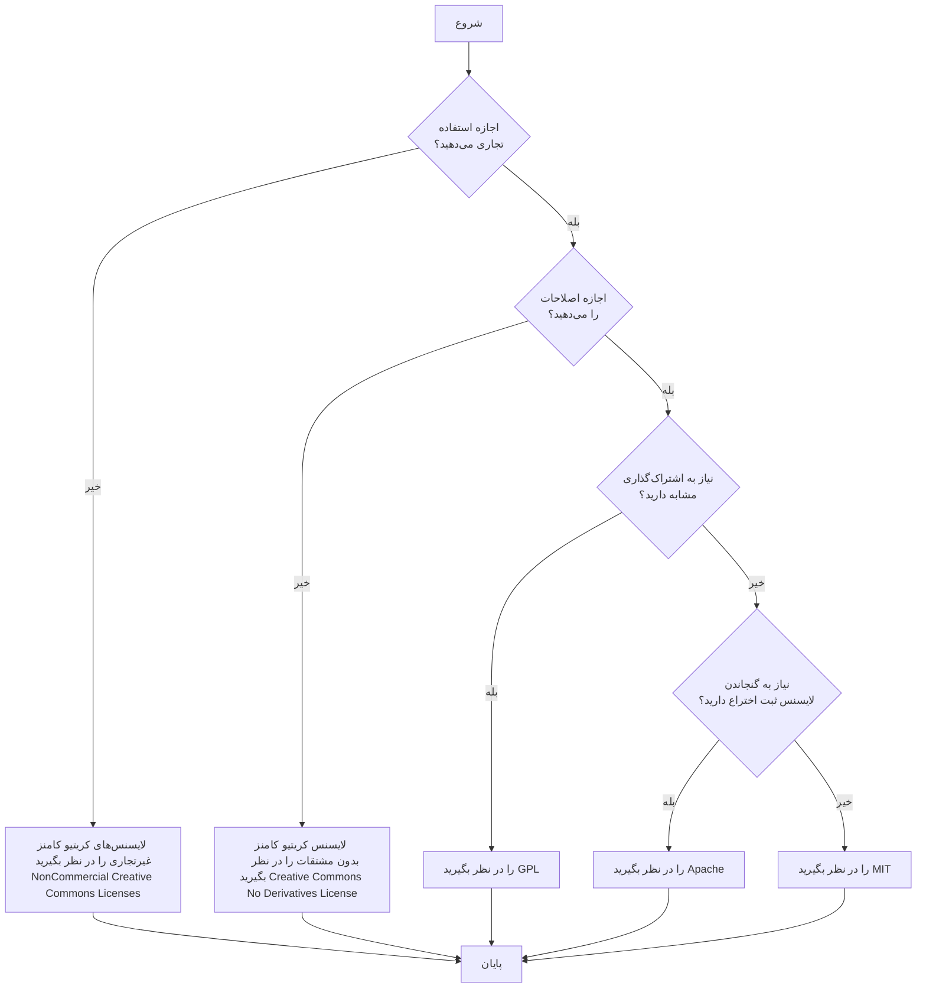

# راهنمای لایسنس

[](https://opensource.org/licenses/MIT)


[](https://github.com/amirallami-code/license-guide/stargazers)


این راهنمای جامع تمام جنبه‌های لایسنس نرم‌افزار را پوشش می‌دهد، از درک انواع مختلف لایسنس‌ها گرفته تا انتخاب و اعمال لایسنس مناسب برای پروژه شما. این راهنما شامل مقایسه‌های دقیق، مثال‌های عملی و روندهای نوظهور در لایسنس نرم‌افزار است. چه مبتدی باشید چه توسعه‌دهنده‌ای با تجربه، این راهنما بینش‌های ارزشمندی درباره پیامدهای حقوقی و عملی لایسنس نرم‌افزار ارائه می‌دهد. موضوعات کلیدی شامل لایسنس‌های متن‌باز در مقابل اختصاصی، سازگاری لایسنس‌ها، جنبه‌های بین‌المللی و تأثیر لایسنس بر استراتژی‌های درآمدزایی است.

#### زبان‌های موجود

- [انگلیسی (English)](README.md)
- [فارسی](README.fa.md)

## فهرست مطالب

- [خلاصه سریع](#خلاصه-سریع)
- [مقدمه](#مقدمه)
- [نظرات کارشناسان](#نظرات-کارشناسان)
- [چرا لایسنس‌ها مهم هستند](#چرا-لایسنس-ها-مهم-هستند)
- [تاریخچه لایسنس‌های نرم‌افزاری](#تاریخچه-لایسنس-های-نرم-افزاری)
- [انواع لایسنس‌ها](#انواع-لایسنس-ها)
  - [لایسنس‌های متن‌باز](#لایسنس-های-متن-باز)
  - [لایسنس‌های اختصاصی](#لایسنس-های-اختصاصی)
- [لایسنس‌های مخصوص گیت‌هاب](#لایسنس-های-مخصوص-گیت-هاب)
- [انتخاب لایسنس مناسب](#انتخاب-لایسنس-مناسب)
- [نحوه اعمال لایسنس](#نحوه-اعمال-لایسنس)
  - [راهنمای گام به گام](#راهنمای-گام-به-گام)
  - [دستورالعمل‌های مخصوص گیت‌هاب](#دستورالعمل-های-مخصوص-گیت-هاب)
- [مقایسه لایسنس‌ها](#مقایسه-لایسنس-ها)
- [لایسنس‌های کریتیو کامنز](#لایسنس-های-کریتیو-کامنز)
- [سازگاری بین لایسنس‌ها](#سازگاری-بین-لایسنس-ها)
- [پیامدهای حقوقی انتخاب لایسنس](#پیامد-های-حقوقی-انتخاب-لایسنس)
- [تغییر یا به‌روزرسانی لایسنس‌ها](#تغییر-یا-به-روزرسانی-لایسنس-ها)
- [جنبه‌های بین‌المللی لایسنس دهی](#جنبه-های-بین-المللی-لایسنس-دهی)
- [لایسنس دهی و کسب درآمد](#لایسنس-دهی-و-کسب-درآمد)
- [مثال‌های عملی و مطالعات موردی](#مثال-های-عملی-و-مطالعات-موردی)
- [مطالعات موردی گسترده](#مطالعات-موردی-گسترده)
- [لایسنس‌های مخصوص صنایع](#لایسنس-های-مخصوص-صنایع)
- [روندهای نوظهور در لایسنس نرم‌افزار](#روند-های-نوظهور-در-لایسنس-نرم-افزار)
- [ابزارهای مدیریت لایسنس](#ابزار-های-مدیریت-لایسنس)
- [سوالات متداول](#سوالات-متداول)
- [منابع اضافی](#منابع-اضافی)
- [به‌روزرسانی‌ها و نگهداری](#به-روزرسانی-ها-و-نگهداری)
- [مشارکت](#مشارکت)
- [لایسنس](#لایسنس)
- [ارتباط با ما](#ارتباط-با-ما)

## خلاصه سریع

این راهنمای لایسنس شامل موارد زیر است:

1. **انواع لایسنس‌ها**: متن‌باز (MIT, GPL, Apache و غیره) و اختصاصی
2. **انتخاب لایسنس**: در نظر گرفتن اهداف پروژه، جامعه، سازگاری و مدل کسب و کار
3. **اعمال لایسنس**: راهنمای گام به گام برای افزودن لایسنس به پروژه شما
4. **مقایسه لایسنس‌ها**: جدول مقایسه ویژگی‌های لایسنس‌های محبوب
5. **مثال‌های عملی**: سناریوهای واقعی استفاده از لایسنس و تغییرات آن
6. **سوالات متداول**: سوالات رایج درباره لایسنس نرم‌افزار
7. **منابع اضافی**: لینک‌هایی برای مطالعه بیشتر و ابزارها

نکات کلیدی:
- لایسنس‌ها از حقوق شما محافظت می‌کنند و شرایط را برای کاربران روشن می‌سازند
- لایسنس‌های متن‌باز از آزاد (MIT) تا کپی‌لفت (GPL) متغیر هستند
- هنگام استفاده از چندین کتابخانه، سازگاری لایسنس را در نظر بگیرید
- تغییر لایسنس‌ها می‌تواند پیچیده باشد، به ویژه با مشارکت‌کنندگان متعدد
- همیشه نسبت دهی مناسب را شامل کنید و به شرایط لایسنس پایبند باشید

به یاد داشته باشید: در حالی که این راهنما اطلاعات عمومی ارائه می‌دهد، برای مشاوره خاص در مورد پروژه‌های نرم‌افزاری و نیازهای لایسنس خود، همیشه با یک متخصص حقوقی مشورت کنید.

## مقدمه

لایسنس نرم‌افزار یک ابزار حقوقی است که استفاده، اصلاح و توزیع نرم‌افزار را کنترل می‌کند. این راهنمای جامع به شما کمک می‌کند تا انواع مختلف لایسنس‌ها را درک کنید، مناسب‌ترین گزینه را برای پروژه خود انتخاب کنید و آن را به درستی در مخزن خود اعمال کنید.

## نظرات کارشناسان

برای ارائه دیدگاه و تخصص اضافی، ما بینش‌هایی از کارشناسان حقوقی و متخصصان صنعت جمع‌آوری کرده‌ایم:

> "درک لایسنس‌های نرم‌افزاری برای هر توسعه‌دهنده یا شرکتی که با نرم‌افزار کار می‌کند یا آن را ایجاد می‌کند، بسیار مهم است. این فقط درباره انطباق قانونی نیست، بلکه درباره تصمیم‌گیری آگاهانه است که با اهداف و ارزش‌های پروژه شما همسو باشد."
> - جین دو (Jane Doe)، وکیل مالکیت معنوی

> "انتخاب لایسنس می‌تواند تأثیر قابل توجهی بر پذیرش پروژه، مشارکت جامعه و حتی دوام طولانی مدت آن داشته باشد. این تصمیمی نیست که باید سرسری گرفته شود."
> - جان اسمیت (John Smith)، مدافع متن‌باز در TechCorp

> "با ظهور هوش مصنوعی و یادگیری ماشینی، ما چالش‌های جدیدی در لایسنس نرم‌افزار می‌بینیم. مهم‌تر از همیشه است که درباره روندهای نوظهور و تأثیرات بالقوه آنها آگاه باشیم."
> - دکتر امیلی جانسون (Dr. Emily Johnson)، پژوهشگر اخلاق هوش مصنوعی

این نظرات کارشناسی بر اهمیت درک و در نظر گرفتن دقیق لایسنس نرم‌افزار در پروژه‌های شما تأکید می‌کند.

## چرا لایسنس ها مهم هستند

لایسنس‌ها به چند دلیل مهم هستند:

1. **حفاظت از حقوق**: آنها از حقوق مالکیت معنوی توسعه‌دهندگان محافظت می‌کنند.
2. **شفافیت**: آنها شرایط استفاده از نرم‌افزار را برای کاربران و مشارکت‌کنندگان به وضوح مشخص می‌کنند.
3. **همکاری**: آنها چارچوبی برای همکاری و مشارکت در پروژه‌ها فراهم می‌کنند.
4. **انطباق قانونی**: آنها به جلوگیری از مشکلات حقوقی بالقوه و سوء تفاهم‌ها کمک می‌کنند.
5. **به رسمیت شناختن**: آنها نسبت دهی مناسب و به رسمیت شناختن کار توسعه‌دهندگان را تضمین می‌کنند.
6. **ایجاد جامعه**: آنها می‌توانند انواع خاصی از مشارکت‌کنندگان و کاربران را جذب یا دفع کنند.
7. **استراتژی کسب و کار**: آنها می‌توانند بر توانایی شما برای درآمدزایی یا توزیع نرم‌افزارتان تأثیر بگذارند.
8. **ترویج نوآوری**: آنها می‌توانند بر اساس شرایط خود، نوآوری را تشویق یا محدود کنند.
9. **قابلیت همکاری**: آنها می‌توانند بر نحوه ادغام نرم‌افزار شما با سایر پروژه‌ها تأثیر بگذارند.

### تاریخچه لایسنس های نرم افزاری

سیر تکامل لایسنس‌های نرم‌افزاری نشان‌دهنده تغییرات در فضای توسعه و توزیع نرم‌افزار است:

#### دهه ۱۹۵۰-۱۹۶۰: روزهای آغازین
- اکثر نرم‌افزارها همراه با سخت‌افزار عرضه می‌شدند و به راحتی بین محققان به اشتراک گذاشته می‌شدند
- IBM پیشگام شیوه "bundling" بود که در آن نرم‌افزار به صورت رایگان همراه با خرید سخت‌افزار ارائه می‌شد
- کد منبع معمولاً توزیع می‌شد تا کاربران بتوانند اشکالات را رفع و بهبودهایی را اعمال کنند

#### ۱۹۶۹-۱۹۷۰: آغاز نرم‌افزارهای اختصاصی
- در سال ۱۹۶۹، IBM تصمیم خود برای جداسازی نرم‌افزار از سخت‌افزار را اعلام کرد
- این نقطه آغاز صنعت نرم‌افزارهای تجاری بود
- نرم‌افزار به عنوان یک دارایی اختصاصی در نظر گرفته شد

#### دهه ۱۹۸۰: ظهور حمایت از حق نشر
- ۱۹۸۰: قانون کپی‌رایت آمریکا برای شامل شدن برنامه‌های کامپیوتری اصلاح شد
- ۱۹۸۳: ریچارد استالمن پروژه GNU را اعلام کرد
- ۱۹۸۵: بنیاد نرم‌افزار آزاد (FSF) تأسیس شد
- ۱۹۸۹: اولین نسخه از GPL (مجوز عمومی گنو) توسط ریچارد استالمن منتشر شد

#### دهه ۱۹۹۰: جنبش متن‌باز
- ۱۹۹۱: هسته لینوکس تحت لایسنس GPL توسط لینوس توروالدز منتشر شد
- ۱۹۹۷: اریک ریموند "کلیسای جامع و بازار" را منتشر کرد
- ۱۹۹۸: بنیاد متن‌باز (OSI) تأسیس شد
- ۱۹۹۸: موزیلا توسط نت‌اسکیپ به عنوان متن‌باز منتشر شد
- ۱۹۹۸: اصطلاح "متن‌باز" توسط کریستین پیترسون ابداع شد

#### دهه ۲۰۰۰: گسترش انواع لایسنس
- ۲۰۰۴: ایجاد لایسنس‌های کریتیو کامنز
- ۲۰۰۴: انتشار لایسنس عمومی موزیلا ۱.۱
- ۲۰۰۴: انتشار اوبونتو لینوکس تحت GPL
- ۲۰۰۷: انتشار GPLv3 برای پرداختن به مسائل پتنت و محدودیت‌های سخت‌افزاری

#### دهه ۲۰۱۰: روندهای مدرن لایسنس
- ۲۰۱۲: لایسنس آپاچی ۲.۰ برای پروژه‌های متن‌باز شرکتی محبوبیت پیدا کرد
- ۲۰۱۵: افزایش محبوبیت لایسنس‌های آزاد نسبت به کپی‌لفت
- ۲۰۱۸: معرفی لایسنس‌های اخلاقی جدید
- ۲۰۱۹: ظهور لایسنس‌های منبع-در-دسترس مانند SSPL مونگو‌دی‌بی

#### ایجادکنندگان و مشارکت‌کنندگان کلیدی لایسنس:
- **ریچارد استالمن**: ایجاد GPL و تأسیس بنیاد نرم‌افزار آزاد (۱۹۸۵)
- **لینوس توروالدز**: انتخاب GPL برای هسته لینوکس (۱۹۹۱)
- **اریک ریموند و بروس پرنس**: تأسیس بنیاد متن‌باز (۱۹۹۸)
- **لارنس لسیگ**: تأسیس کریتیو کامنز (۲۰۰۱)
- **بنیاد نرم‌افزار آپاچی**: ایجاد لایسنس آپاچی (۱۹۹۵، به‌روزرسانی ۲۰۰۴)
- **بنیاد موزیلا**: ایجاد لایسنس عمومی موزیلا (۱۹۹۸)

این تاریخچه نشان می‌دهد که چگونه لایسنس‌های نرم‌افزاری از یک مدل اشتراک‌گذاری دانشگاهی به یک اکوسیستم پیچیده تبدیل شده‌اند که منافع تجاری، همکاری باز و آزادی‌های کاربر را متعادل می‌کند.


## انواع لایسنس ها

در اینجا مقایسه‌ای از انواع اصلی لایسنس‌ها آمده است (پیشنهاد می‌کنم از نسخه وب گیت‌هاب برای بررسی فلو‌چارت زیر استفاده کنید):



این نمودار دسته‌های اصلی و برخی نمونه‌های محبوب لایسنس‌های نرم‌افزاری را نشان می‌دهد.

### لایسنس های متن باز

شماره 1. **لایسنس MIT (MIT License)**
   - ساده و آزاد
   - اجازه استفاده تجاری و خصوصی را می‌دهد
   - نیاز به حفظ اعلامیه‌های کپی‌رایت و لایسنس دارد
   
شماره 2. **لایسنس عمومی گنو (GNU General Public License - GPL)**
   - تضمین‌کننده آزادی نرم‌افزار
   - نیاز دارد که آثار مشتق شده نیز متن‌باز باقی بمانند
   - نسخه‌های مختلف: GPLv2, GPLv3
   
شماره 3. **لایسنس آپاچی 2.0 (Apache License 2.0)**
   - مناسب برای پروژه‌های بزرگ
   - شامل حقوق ثبت اختراع
   - نیاز به بیان تغییرات دارد
   
شماره 4. **لایسنس‌های BSD (BSD Licenses)**
   - خانواده‌ای از لایسنس‌های نرم‌افزار آزاد با محدودیت‌های حداقلی
   - محدودیت‌های حداقلی در استفاده و توزیع مجدد نرم‌افزار تحت پوشش

شماره 5. **لایسنس عمومی موزیلا 2.0 (Mozilla Public License 2.0)**
   - لایسنس کپی‌لفت ضعیف
   - کپی‌لفت در سطح فایل

شماره 6. **لایسنس عمومی کمتر گنو (GNU Lesser General Public License - LGPL)**
   - طراحی شده برای کتابخانه‌ها
   - اجازه لینک از برنامه‌های غیر GPL را می‌دهد

شماره 7. **لایسنس عمومی اکلیپس (Eclipse Public License - EPL)**
   - لایسنس کپی‌لفت مورد استفاده توسط بنیاد اکلیپس
   - شامل اعطای حق ثبت اختراع

شماره 8. **لایسنس عمومی آفرو گنو (GNU Affero General Public License - AGPL)**
   - مشابه GPL، اما همچنین استفاده شبکه را پوشش می‌دهد

شماره 9. **لایسنس ISC (ISC License)**
   - از نظر عملکردی معادل با لایسنس‌های BSD 2-Clause و MIT

شماره 10. **لایسنس هنری 2.0 (Artistic License 2.0)**
    - عمدتاً برای ماژول‌ها و برنامه‌های Perl استفاده می‌شود

### لایسنس های اختصاصی

شماره 1. **نرم‌افزار اختصاصی (Proprietary Software)**
   - تمام حقوق محفوظ است
   - معمولاً برای نرم‌افزارهای تجاری

شماره 2. **لایسنس‌های سفارشی (Custom Licenses)**
   - متناسب با نیازهای خاص کسب و کار
   - می‌تواند شرایط مختلفی را ترکیب کند

شماره 3. **لایسنس دوگانه (Dual Licensing)**
   - ارائه نرم‌افزار تحت دو لایسنس متفاوت
   - اغلب یکی متن‌باز و دیگری اختصاصی

شماره 4. **منبع مشترک (Shared Source)**
   - برنامه مایکروسافت که اجازه دسترسی به کد منبع را تحت شرایط خاصی می‌دهد

شماره 5. **فریمیوم (Freemium)**
   - ویژگی‌های اساسی رایگان هستند، اما ویژگی‌های پیشرفته نیاز به پرداخت دارند

## لایسنس های مخصوص گیت هاب

گیت‌هاب مجموعه‌ای از لایسنس‌ها را ارائه می‌دهد که می‌توانند به راحتی به مخازن اضافه شوند. در اینجا فهرستی از لایسنس‌های موجود از طریق انتخابگر لایسنس گیت‌هاب آمده است:

1. لایسنس آپاچی 2.0 (Apache License 2.0)
2. لایسنس عمومی گنو نسخه 3.0 (GNU General Public License v3.0)
3. لایسنس MIT (MIT License)
4. لایسنس BSD 2-Clause "ساده شده" (BSD 2-Clause "Simplified" License)
5. لایسنس BSD 3-Clause "جدید" یا "تجدید نظر شده" (BSD 3-Clause "New" or "Revised" License)
6. لایسنس نرم‌افزار Boost 1.0 (Boost Software License 1.0)
7. لایسنس کریتیو کامنز صفر v1.0 جهانی (Creative Commons Zero v1.0 Universal)
8. لایسنس عمومی اکلیپس 2.0 (Eclipse Public License 2.0)
9. لایسنس عمومی آفرو گنو نسخه 3.0 (GNU Affero General Public License v3.0)
10. لایسنس عمومی گنو نسخه 2.0 (GNU General Public License v2.0)
11. لایسنس عمومی کمتر گنو نسخه 2.1 (GNU Lesser General Public License v2.1)
12. لایسنس عمومی موزیلا 2.0 (Mozilla Public License 2.0)
13. لایسنس بدون مجوز (The Unlicense)

## انتخاب لایسنس مناسب

هنگام انتخاب لایسنس، این عوامل را در نظر بگیرید:

1. **اهداف پروژه**: آیا می‌خواهید پروژه کاملاً باز باشد یا کنترل بیشتری داشته باشید؟
2. **جامعه هدف**: آیا می‌خواهید جامعه‌ای از مشارکت‌کنندگان را تشویق کنید؟
3. **سازگاری**: آیا از کتابخانه‌هایی با لایسنس‌های خاص استفاده می‌کنید؟
4. **مدل کسب و کار**: آیا قصد تجاری‌سازی پروژه خود را دارید؟
5. **حقوق ثبت اختراع**: آیا نیاز به در نظر گرفتن حفاظت از ثبت اختراع دارید؟
6. **آثار مشتق**: چگونه می‌خواهید دیگران از کار شما استفاده کنند و بر اساس آن بسازند؟
7. **اندازه و پیچیدگی پروژه**: لایسنس‌های متفاوت ممکن است برای پروژه‌های بزرگتر یا پیچیده‌تر مناسب‌تر باشند.
8. **استانداردهای صنعت**: برخی صنایع لایسنس‌های ترجیحی دارند.
9. **ملاحظات جغرافیایی**: مناطق مختلف ممکن است الزامات قانونی خاصی داشته باشند.
10. **برنامه‌های آینده**: در نظر بگیرید که انتخاب شما چگونه ممکن است بر توسعه‌های آینده یا مشارکت‌ها تأثیر بگذارد.

در اینجا یک نمودار جریان برای کمک به انتخاب لایسنس مناسب آمده است (پیشنهاد می‌کنم از نسخه وب گیت‌هاب برای بررسی فلو‌چارت زیر استفاده کنید):



## نحوه اعمال لایسنس

### راهنمای گام به گام

1. لایسنس مناسبی را بر اساس عوامل بحث شده در بالا انتخاب کنید.
2. یک فایل `LICENSE` در دایرکتوری ریشه پروژه خود ایجاد کنید.
3. متن کامل لایسنس انتخابی خود را در فایل `LICENSE` کپی کنید.
4. یک اعلامیه کوتاه لایسنس را در بالای هر فایل منبع در پروژه خود اضافه کنید.
5. اطلاعات لایسنس را در مستندات پروژه خود بگنجانید.

در اینجا مثال‌هایی از نحوه افزودن اطلاعات لایسنس به انواع مختلف فایل‌ها آمده است:

```plaintext
# Python (.py)
# Copyright (c) 2024 اسم شما
# This file is part of Project Name, licensed under the MIT License.
# See the LICENSE file in the project root for full license text.

# JavaScript (.js)
/**
 * @license
 * Copyright (c) 2024 اسم شما
 * This file is part of Project Name, licensed under the MIT License.
 * See the LICENSE file in the project root for full license text.
 */

// C++ (.cpp)
// Copyright (c) 2024 اسم شما
// This file is part of Project Name, licensed under the MIT License.
// See the LICENSE file in the project root for full license text.

<!-- HTML (.html) -->
<!--
 Copyright (c) 2024 اسم شما
 This file is part of Project Name, licensed under the MIT License.
 See the LICENSE file in the project root for full license text.
-->

# Bash (.sh)
#!/bin/bash
# Copyright (c) 2024 اسم شما
# This file is part of Project Name, licensed under the MIT License.
# See the LICENSE file in the project root for full license text.

// Java (.java)
/*
 * Copyright (c) 2024 اسم شما
 * This file is part of Project Name, licensed under the MIT License.
 * See the LICENSE file in the project root for full license text.
 */

-- SQL (.sql)
-- Copyright (c) 2024 اسم شما
-- This file is part of Project Name, licensed under the MIT License.
-- See the LICENSE file in the project root for full license text.
```

### دستورالعمل های مخصوص گیت هاب

1. به مخزن خود در GitHub بروید.
2. روی دکمه "Add file" کلیک کنید و "Create new file" را انتخاب کنید.
3. فایل را `LICENSE` یا `LICENSE.md` نام‌گذاری کنید.
4. روی دکمه "Choose a license template" کلیک کنید.
5. لایسنس مورد نظر خود را از لیست انتخاب کنید.
6. فیلدهای مورد نیاز (مانند نام کامل) را پر کنید.
7. روی دکمه "Review and submit" کلیک کنید.
8. فایل لایسنس جدید را به مخزن خود کامیت کنید.

## مقایسه لایسنس ها

| لایسنس | استفاده تجاری | تغییر | توزیع | استفاده از پتنت | استفاده خصوصی | زیرلایسنس | استفاده از علامت تجاری | شرایط |
|---------|----------------|--------|------------|------------|-------------|------------|---------------|------------|
| MIT     | ✅             | ✅     | ✅         | ✅         | ✅          | ✅         | ❌            | شامل کپی‌رایت و لایسنس |
| GPLv3   | ✅             | ✅     | ✅         | ✅         | ✅          | ✅         | ❌            | افشای منبع، همان لایسنس |
| Apache 2.0 | ✅          | ✅     | ✅         | ✅         | ✅          | ✅         | ❌            | بیان تغییرات، اعطای پتنت |
| BSD 3-Clause | ✅        | ✅     | ✅         | ❌         | ✅          | ✅         | ❌            | شامل لایسنس |
| MPL 2.0 | ✅             | ✅     | ✅         | ✅         | ✅          | ✅         | ❌            | افشای منبع |
| LGPL v3 | ✅             | ✅     | ✅         | ✅         | ✅          | ✅         | ❌            | افشای منبع، تغییرات کتابخانه |
| AGPL v3 | ✅             | ✅     | ✅         | ✅         | ✅          | ✅         | ❌            | افشای منبع، استفاده شبکه |
| EPL 2.0 | ✅             | ✅     | ✅         | ✅         | ✅          | ✅         | ❌            | افشای منبع، بیان تغییرات |
| Unlicense | ✅           | ✅     | ✅         | ✅         | ✅          | ✅         | ✅            | بدون شرط |
| اختصاصی | ❌         | ❌     | ❌         | ❌         | ✅          | ❌         | ✅            | نیاز به اجازه صریح |


## لایسنس های کریتیو کامنز

اگرچه عمدتاً برای آثار خلاقانه استفاده می‌شود، برخی پروژه‌های نرم‌افزاری از لایسنس‌های کریتیو کامنز برای مستندات استفاده می‌کنند:

‏1. CC0 (بدون حقوق محفوظ)
‏2. CC BY (ارجاع)
‏3. CC BY-SA (ارجاع-اشتراک‌گذاری یکسان)
‏4. CC BY-ND (ارجاع-بدون اشتقاق)
‏5. CC BY-NC (ارجاع-غیرتجاری)
‏6. CC BY-NC-SA (ارجاع-غیرتجاری-اشتراک‌گذاری یکسان)
‏7. CC BY-NC-ND (ارجاع-غیرتجاری-بدون اشتقاق)

لازم به ذکر است که لایسنس‌های کریتیو کامنز برای خود نرم‌افزار توصیه نمی‌شوند، زیرا می‌توانند مشکلات سازگاری ایجاد کنند و به مسائل خاص نرم‌افزار مانند حقوق پتنت نمی‌پردازند.

## سازگاری بین لایسنس ها

سازگاری لایسنس هنگام ترکیب نرم‌افزارها یا کتابخانه‌هایی با لایسنس‌های مختلف بسیار مهم است. در اینجا یک نمای کلی مختصر ارائه شده است:

- لایسنس‌های MIT و BSD عموماً با اکثر لایسنس‌های دیگر سازگار هستند.
- لایسنس‌های GPL با یکدیگر سازگار هستند اما ممکن است با برخی لایسنس‌های دیگر سازگار نباشند.
- لایسنس Apache 2.0 با GPLv3 سازگار است، اما با GPLv2 سازگار نیست.
- لایسنس‌های کریتیو کامنز برای نرم‌افزار توصیه نمی‌شوند و ممکن است مشکلات سازگاری ایجاد کنند.

همیشه هنگام ترکیب نرم‌افزارهایی با لایسنس‌های مختلف، شرایط خاص هر لایسنس را بررسی کنید. برای کمک به حل مسائل پیچیده سازگاری، از ابزارهایی مانند [ماتریس سازگاری لایسنس](https://www.gnu.org/licenses/license-compatibility.html) که توسط بنیاد نرم‌افزار آزاد ارائه شده است، استفاده کنید.

## پیامد های حقوقی انتخاب لایسنس

انتخاب یک لایسنس نرم‌افزاری پیامدهای حقوقی مهمی دارد. در اینجا برخی از ملاحظات کلیدی آورده شده است:

شماره 1. **لایسنس‌های کپی‌لفت (مانند GPL)**
   - نیاز دارند که آثار مشتق شده تحت همان لایسنس منتشر شوند
   - می‌توانند سازگاری با نرم‌افزارهای اختصاصی را محدود کنند
   - ممکن است بر توانایی شما برای کسب درآمد مستقیم از نرم‌افزار تأثیر بگذارند

شماره 2. **لایسنس‌های آزاد (مانند MIT، Apache)**
   - انعطاف‌پذیری بیشتری در نحوه استفاده و توزیع نرم‌افزار اجازه می‌دهند
   - ممکن است محافظت کمتری در برابر دعاوی حقوقی پتنت ارائه دهند (به جز Apache)
   - می‌توانند راحت‌تر در نرم‌افزارهای اختصاصی گنجانده شوند

شماره 3. **لایسنس‌های اختصاصی**
   - بیشترین کنترل را بر نرم‌افزار شما فراهم می‌کنند
   - ممکن است پذیرش و مشارکت جامعه را محدود کنند
   - نیاز به مدیریت دقیق شرایط لایسنس و اجرای آن دارند

شماره 4. **لایسنس دوگانه**
   - می‌تواند انعطاف‌پذیری ارائه دهد اما نیاز به مدیریت دقیق دارد
   - ممکن است بسته به حوزه قضایی شما پیامدهای مالیاتی داشته باشد

شماره 5. **بدون لایسنس**
   - به طور پیش‌فرض، نرم‌افزار تحت کپی‌رایت انحصاری قرار می‌گیرد
   - دیگران هیچ حق قانونی برای استفاده، تغییر یا اشتراک‌گذاری کد ندارند
   - می‌تواند منجر به عدم قطعیت‌های حقوقی شود و استفاده از نرم‌افزار را محدود کند

شماره 6. **حقوق پتنت**
   - برخی لایسنس‌ها (مانند Apache) شامل لایسنس‌های پتنت هستند
   - دیگران (مانند MIT) به طور صریح به پتنت‌ها نمی‌پردازند

شماره 7. **توافق‌نامه‌های مشارکت‌کنندگان**
   - می‌تواند به مدیریت مشارکت‌ها و تغییرات احتمالی لایسنس کمک کند
   - اگر بیش از حد محدودکننده باشد، ممکن است برخی از مشارکت‌کنندگان را دلسرد کند

به یاد داشته باشید: این راهنما اطلاعات عمومی ارائه می‌دهد. همیشه برای مشاوره خاص وضعیت و حوزه قضایی خود با یک متخصص حقوقی مشورت کنید.

## تغییر یا به روزرسانی لایسنس ها

تغییر لایسنس یک پروژه می‌تواند پیچیده باشد:

1. اگر شما تنها دارنده حق کپی‌رایت هستید، می‌توانید لایسنس را به اختیار خود تغییر دهید.
2. اگر چندین مشارکت‌کننده وجود دارد، شما به اجازه از تمام دارندگان حق کپی‌رایت نیاز دارید.
3. برخی لایسنس‌ها (مانند GPL) تغییر به یک لایسنس محدودکننده‌تر را دشوار یا غیرممکن می‌کنند.
4. برای مدیریت مشارکت‌ها و تغییرات احتمالی لایسنس، استفاده از ابزارهایی مانند CLA (توافق‌نامه لایسنس مشارکت‌کننده) را در نظر بگیرید.

هنگام تغییر لایسنس‌ها، ارتباط شفاف با جامعه کاربران و مشارکت‌کنندگان خود در مورد دلایل تغییر و پیامدهای آن بسیار مهم است.

## جنبه های بین المللی لایسنس دهی

لایسنس‌دهی نرم‌افزار می‌تواند پیامدهای بین‌المللی داشته باشد:

1. اکثر لایسنس‌های منبع باز برای کاربرد بین‌المللی طراحی شده‌اند.
2. برخی کشورها ممکن است الزامات یا تفسیرهای خاصی از برخی شرایط لایسنس داشته باشند.
3. کنوانسیون برن چارچوبی برای حفاظت از کپی‌رایت بین‌المللی ارائه می‌دهد.
4. هنگام برخورد با مسائل لایسنس‌دهی بین‌المللی، مشورت با کارشناسان حقوقی را در نظر بگیرید.

از مقررات خاص منطقه‌ای، مانند دستورالعمل کپی‌رایت اتحادیه اروپا، که ممکن است بر نحوه استفاده و توزیع نرم‌افزار در مناطق خاص تأثیر بگذارد، آگاه باشید.

## لایسنس دهی و کسب درآمد

لایسنس‌های مختلف می‌توانند بر توانایی شما برای کسب درآمد از نرم‌افزارتان تأثیر بگذارند:

1. لایسنس‌های آزاد (MIT، Apache) استفاده تجاری و ادغام آسان‌تر را امکان‌پذیر می‌کنند.
2. لایسنس‌های کپی‌لفت (GPL) می‌توانند از طریق پشتیبانی، خدمات یا لایسنس دوگانه درآمدزایی شوند.
3. لایسنس‌های اختصاصی بیشترین کنترل را بر درآمدزایی ارائه می‌دهند اما ممکن است پذیرش را محدود کنند.
4. مدل‌های هسته باز، عناصر منبع باز و اختصاصی را ترکیب می‌کنند.

هنگام انتخاب یک لایسنس، اهداف تجاری بلندمدت خود را در نظر بگیرید، زیرا می‌تواند تأثیر قابل توجهی بر استراتژی‌های درآمدزایی و پتانسیل مشارکت یا خرید داشته باشد.

## مثال های عملی و مطالعات موردی

### مثال 1: پروژه با وابستگی‌های متعدد

فرض کنید در حال توسعه یک نرم‌افزار مدیریت پروژه هستید که از چندین کتابخانه منبع باز استفاده می‌کند:

1. کتابخانه A: لایسنس MIT
2. کتابخانه B: GPLv3
3. کتابخانه C: Apache 2.0

ملاحظات:
- اگر می‌خواهید پروژه خود را تحت لایسنس MIT منتشر کنید، اطمینان حاصل کنید که کتابخانه B (GPLv3) از طریق لینک پویا استفاده می‌شود.
- اگر از کتابخانه B با لینک استاتیک استفاده می‌کنید، باید کل پروژه خود را تحت GPLv3 منتشر کنید.
- صرف نظر از انتخاب شما، اطلاعات لایسنس برای تمام کتابخانه‌ها را در مستندات پروژه خود قرار دهید.

### مثال 2: تغییر لایسنس در یک پروژه بزرگ

شرکت XYZ تصمیم می‌گیرد لایسنس یکی از پروژه‌های منبع باز خود را از MIT به Apache 2.0 تغییر دهد. مراحل درگیر:

1. بررسی تمام مشارکت‌کنندگان و اطمینان از موافقت آنها با تغییر لایسنس.
2. ایجاد یک توافق‌نامه لایسنس مشارکت‌کننده (CLA) برای مشارکت‌کنندگان آینده.
3. به‌روزرسانی فایل LICENSE در ریشه پروژه.
4. به‌روزرسانی تمام سرصفحه‌های فایل‌های منبع با اطلاعات لایسنس جدید.
5. به‌روزرسانی README و سایر مستندات.
6. اعلام تغییر لایسنس به جامعه کاربران و مشارکت‌کنندگان.

### مثال 3: استفاده از لایسنس‌های کریتیو کامنز در پروژه‌های نرم‌افزاری

یک شرکت نرم‌افزاری تصمیم می‌گیرد از CC BY-SA 4.0 برای مستندات پروژه خود استفاده کند، در حالی که کد منبع را تحت لایسنس MIT نگه می‌دارد.

مزایا:
- اجازه اشتراک‌گذاری و تطبیق آزادانه مستندات را می‌دهد.
- اطمینان از ارجاع و اشتراک‌گذاری یکسان برای مستندات.

معایب:
- پیچیدگی در مدیریت دو لایسنس مختلف برای یک پروژه.
- احتمال سردرگمی برای کاربران و مشارکت‌کنندگان.

### مثال 4: تفاوت‌های فرهنگی و جغرافیایی در لایسنس‌دهی

- در اتحادیه اروپا، دستورالعمل کپی‌رایت دیجیتال می‌تواند بر نحوه استفاده از محتوای دارای لایسنس در پلتفرم‌های آنلاین تأثیر بگذارد.
- برخی کشورها الزامات خاصی برای پروژه‌های نرم‌افزاری با بودجه دولتی دارند.
- در برخی حوزه‌های قضایی، حقوق معنوی قابل چشم‌پوشی نیستند، که می‌تواند بر نحوه برخورد با ارجاع تأثیر بگذارد.

### مثال 5: مدل هسته باز

شرکت ABC محصول اصلی خود را تحت یک لایسنس منبع باز (مثلاً MIT) منتشر می‌کند اما ویژگی‌های پریمیوم را تحت یک لایسنس اختصاصی ارائه می‌دهد.

مزایا:
- با هسته منبع باز، پایگاه کاربری گسترده‌ای را جذب می‌کند.
- امکان درآمدزایی از طریق ویژگی‌های پریمیوم را فراهم می‌کند.

معایب:
- متعادل کردن توسعه منبع باز و اختصاصی می‌تواند چالش‌برانگیز باشد.
- خطر انشعاب جامعه اگر تعادل به خوبی حفظ نشود.

## مطالعات موردی گسترده

### مطالعه موردی 1: وردپرس و GPL

وردپرس، یکی از محبوب‌ترین سیستم‌های مدیریت محتوا، تحت لایسنس GPLv2+ قرار دارد. این مطالعه موردی بررسی می‌کند:

- چرا وردپرس GPL را انتخاب کرد
- چگونه GPL بر اکوسیستم و مدل تجاری وردپرس تأثیر گذاشته است
- چالش‌ها و بحث‌های پیرامون لایسنس‌دهی قالب‌ها و افزونه‌های وردپرس

### مطالعه موردی 2: تغییر لایسنس MongoDB

در سال 2018، MongoDB لایسنس خود را از AGPL به لایسنس عمومی سمت سرور (SSPL) تغییر داد. این مطالعه موردی بررسی می‌کند:

- دلایل پشت تغییر لایسنس MongoDB
- تأثیر بر کسب و کار و جامعه MongoDB
- واکنش‌های جامعه منبع باز و ارائه‌دهندگان خدمات ابری

### مطالعه موردی 3: بحث لایسنس‌دهی React

در سال 2017، کتابخانه React فیسبوک به دلیل لایسنس BSD + Patents خود مورد بررسی دقیق قرار گرفت. این مطالعه موردی شامل:

- نگرانی‌های مطرح شده توسط جامعه درباره لایسنس اصلی
- پاسخ فیسبوک و تغییر نهایی لایسنس به MIT
- درس‌های آموخته شده درباره اهمیت انتخاب لایسنس در پروژه‌های منبع باز

## لایسنس های مخصوص صنایع

در حالی که بسیاری از لایسنس‌های نرم‌افزاری عمومی هستند، برخی صنایع لایسنس‌های تخصصی برای رفع نیازهای منحصر به فرد خود توسعه داده‌اند:

شماره 1. **مراقبت‌های بهداشتی**
   - لایسنس HIPAA: اطمینان از رعایت مقررات حریم خصوصی داده‌های بهداشتی
   - لایسنس عمومی OpenMRS: مخصوص سیستم‌های ثبت پزشکی

شماره 2. **دولت**
   - توافق‌نامه منبع باز ناسا (NOSA): برای نرم‌افزارهای ایجاد شده توسط ناسا استفاده می‌شود
‏   - CeCILL: لایسنس نرم‌افزار آزاد دولت فرانسه

شماره 3. **آموزش**
   - لایسنس عمومی GNU Affero (AGPL): اغلب در نرم‌افزارهای آموزشی برای اطمینان از اشتراک‌گذاری بهبودها استفاده می‌شود
   - لایسنس جامعه آموزشی: طراحی شده برای مؤسسات آکادمیک و تحقیقاتی

شماره 4. **مخابرات**
   - لایسنس منبع عمومی RealNetworks (RPSL): در برخی برنامه‌های VoIP استفاده می‌شود
   - لایسنس OpenIB.org: برای InfiniBand و سایر فناوری‌های شبکه

شماره 5. **مالی**
   - استثنای لایسنس FOSS: استفاده از برخی نرم‌افزارهای FOSS در برنامه‌های مالی اختصاصی را مجاز می‌کند
   - لایسنس عمومی انطباقی: امکان سفارشی‌سازی بر اساس نیازهای خاص صنعت مالی را فراهم می‌کند

شماره 6. **بازی‌سازی**
   - توافق‌نامه کاربر نهایی (EULA) موتور Unreal: مخصوص بازی‌های توسعه یافته با استفاده از موتور Unreal
‏   - EULA فروشگاه دارایی Unity: برای دارایی‌های مورد استفاده در توسعه بازی Unity

شماره 7. **هوش مصنوعی و یادگیری ماشینی**
   - لایسنس OpenAI: برای برخی مدل‌های هوش مصنوعی استفاده می‌شود، شامل بندهای استفاده اخلاقی است
‏   - Apache 2.0 با بند Commons: توسط برخی شرکت‌های هوش مصنوعی برای محدود کردن استفاده تجاری از مدل‌های خود استفاده می‌شود

هنگام کار در یک صنعت خاص، همیشه بررسی کنید که آیا لایسنس‌های استاندارد صنعت یا مطابق با مقررات وجود دارد که ممکن است برای پروژه شما مناسب‌تر باشد.

# راهنمای لایسنس

## روند های نوظهور در لایسنس نرم‌ افزار

چشم‌انداز مجوزدهی نرم‌افزار همواره در حال تکامل است. در اینجا برخی از روندهای نوظهور آورده شده است:

شماره 1. **لایسنس‌های اخلاقی**
   - مثال: لایسنس هیپوکراتیک، که استفاده‌ای را که حقوق بشر را نقض می‌کند ممنوع می‌کند
   - هدف اطمینان از استفاده نرم‌افزار به روش‌هایی است که با اصول اخلاقی همسو باشد

شماره 2. **مجوزدهی مبتنی بر بلاکچین**
   - از فناوری بلاکچین برای مدیریت و اجرای شرایط لایسنس استفاده می‌کند
   - می‌تواند فرآیندهای مجوزدهی شفاف‌تر و خودکارتری را فراهم کند

شماره 3. **لایسنس‌های مخصوص هوش مصنوعی**
   - به چالش‌های منحصر به فرد مدل‌های هوش مصنوعی و یادگیری ماشینی می‌پردازد
   - مثال: لایسنس OpenAI برای GPT-3، که شامل محدودیت‌های استفاده است

شماره 4. **لایسنس‌های منبع در دسترس**
   - اجازه مشاهده کد منبع را می‌دهد اما حقوق استفاده را محدود می‌کند
   - مثال‌ها: لایسنس عمومی سمت سرور (SSPL)، لایسنس منبع تجاری (BSL)

شماره 5. **لایسنس‌های محدود به زمان**
   - لایسنس‌هایی که پس از یک دوره مشخص، شرایط را تغییر می‌دهند
   - مثال: BSL، که پس از یک زمان مشخص به یک لایسنس منبع باز تبدیل می‌شود

شماره 6. **مجوزدهی مبتنی بر استفاده**
   - شرایط بر اساس نحوه استفاده از نرم‌افزار یا اندازه پایگاه کاربران تغییر می‌کند
   - در نرم‌افزارهای مبتنی بر ابر رایج‌تر می‌شود

شماره 7. **لایسنس‌های جامعه‌محور**
   - برای محافظت و سود رساندن به جامعه منبع باز طراحی شده‌اند
   - مثال: لایسنس استفاده پایدار

شماره 8. **لایسنس‌های قابل سفارشی‌سازی**
   - پلتفرم‌هایی که به توسعه‌دهندگان اجازه می‌دهند لایسنس‌های سفارشی ایجاد کنند
   - مثال: وب‌سایت Choose a License

این رویکردهای جدید مجوزدهی با هدف پرداختن به چشم‌اندازهای فناوری در حال تکامل، مدل‌های کسب و کار و ملاحظات اخلاقی طراحی شده‌اند. همیشه هنگام انتخاب لایسنس برای پروژه خود، جدیدترین گزینه‌های مجوزدهی را بررسی کنید.

## ابزار های مدیریت لایسنس

مدیریت لایسنس‌ها در پروژه‌های نرم‌افزاری می‌تواند پیچیده باشد. در اینجا برخی از ابزارهایی که می‌توانند کمک کنند، آورده شده است:

‏1. FOSSA: فرآیند انطباق با لایسنس و ردیابی آسیب‌پذیری را خودکار می‌کند. [وب‌سایت](https://fossa.com/)

‏2. WhiteSource: مدیریت امنیت منبع باز و انطباق با لایسنس را ارائه می‌دهد. [وب‌سایت](https://www.whitesourcesoftware.com/)

‏3. Black Duck: مجموعه‌ای از ابزارها برای مدیریت امنیت منبع باز و انطباق با لایسنس ارائه می‌دهد. [وب‌سایت](https://www.synopsys.com/software-integrity/security-testing/software-composition-analysis.html)

‏4. LicenseFinder: یک ابزار خط فرمان منبع باز است که وابستگی‌های پروژه شما را اسکن می‌کند و لایسنس‌های آنها را گزارش می‌دهد. [وب‌سایت](https://github.com/pivotal/LicenseFinder)

‏5. ScanCode Toolkit: مجموعه‌ای از ابزارها برای اسکن کد و تشخیص لایسنس‌ها، حق نشر و موارد دیگر. [وب‌سایت](https://scancode-toolkit.readthedocs.io/)

این ابزارها می‌توانند به خودکارسازی فرآیند شناسایی و مدیریت لایسنس‌ها در پروژه‌های شما کمک کنند و انطباق را تضمین کرده و خطرات قانونی را کاهش دهند.

## سوالات متداول

شماره 1. **س: آیا می‌توانم از نرم‌افزار منبع باز در یک پروژه تجاری استفاده کنم؟**
   ج: بله، بسیاری از لایسنس‌های منبع باز اجازه استفاده تجاری را می‌دهند. با این حال، همیشه شرایط خاص لایسنس را بررسی کنید.

شماره 2. **س: تفاوت بین لایسنس‌های مجاز و کپی‌لفت چیست؟**
   ج: لایسنس‌های مجاز (مانند MIT، Apache) آزادی بیشتری در نحوه استفاده و توزیع نرم‌افزار می‌دهند. لایسنس‌های کپی‌لفت (مانند GPL) نیاز دارند که آثار مشتق شده تحت همان لایسنس توزیع شوند.

شماره 3. **س: اگر قصد توزیع کد خود را ندارم، آیا به لایسنس نیاز دارم؟**
   ج: اگرچه به طور دقیق ضروری نیست، اما حتی برای پروژه‌های خصوصی، گنجاندن یک لایسنس یک عملکرد خوب است. این در صورتی که بعداً تصمیم به اشتراک‌گذاری کد خود بگیرید، شرایط را روشن می‌کند.

شماره 4. **س: آیا می‌توانم پس از انتشار پروژه، لایسنس آن را تغییر دهم؟**
   ج: بله، اگر تنها دارنده حق نشر هستید. اگر چندین مشارکت‌کننده وجود دارد، به اجازه آنها نیاز خواهید داشت.

شماره 5. **س: چگونه لایسنس‌دهی برای پروژه‌ای که از چندین کتابخانه منبع باز استفاده می‌کند را مدیریت کنم؟**
   ج: لایسنس‌های تمام کتابخانه‌ها را در مستندات پروژه خود قرار دهید و اطمینان حاصل کنید که لایسنس پروژه شما با لایسنس‌های کتابخانه‌هایی که استفاده می‌کنید سازگار است.

## منابع اضافی

‏1. [Choose a License](https://choosealicense.com/) - یک راهنمای ساده برای انتخاب لایسنس مناسب برای پروژه شما.

‏2. [Open Source Initiative](https://opensource.org/) - متولی تعریف منبع باز (OSD) و نهاد شناخته شده توسط جامعه برای بررسی و تأیید لایسنس‌ها به عنوان مطابق با OSD.

‏3. [Software Freedom Law Center](https://softwarefreedom.org/) - ارائه نمایندگی حقوقی و سایر خدمات مرتبط با قانون برای محافظت و پیشبرد نرم‌افزار آزاد و منبع باز.

‏4. [Creative Commons](https://creativecommons.org/) - برای درک و استفاده از لایسنس‌های کریتیو کامنز.

‏5. [Free Software Foundation](https://www.fsf.org/) - یک سازمان غیرانتفاعی با ماموریت جهانی برای ترویج آزادی کاربران کامپیوتر.

## به‌ روزرسانی‌ ها و نگهداری

این راهنما به طور منظم برای انعکاس آخرین روندها و تغییرات در مجوزدهی نرم‌افزار به‌روزرسانی می‌شود. آخرین به‌روزرسانی: 5 سپتامبر 2024.

اگر متوجه هرگونه اطلاعات قدیمی شدید یا پیشنهادی برای بهبود دارید، لطفاً یک issue باز کنید یا یک pull request ارسال کنید. مشارکت‌های شما به دقیق و مفید ماندن این راهنما برای جامعه کمک می‌کند.

برای اطلاع از تغییرات عمده، این مخزن را در GitHub تماشا کنید (روی چشم کوچک کنار دکمه Fork کلیک کنید و 'All Activity' را انتخاب کنید).

## مشارکت

ما از مشارکت در این راهنمای لایسنس استقبال می‌کنیم! نحوه مشارکت شما:

1. مخزن را fork کنید
2. شاخه ویژگی خود را ایجاد کنید (`git checkout -b feature/AmazingFeature`)
3. تغییرات خود را commit کنید (`git commit -m 'Add some AmazingFeature'`)
4. به شاخه push کنید (`git push origin feature/AmazingFeature`)
5. یک Pull Request باز کنید

لطفاً اطمینان حاصل کنید که تست‌ها را به طور مناسب به‌روزرسانی کرده و به کد رفتار [Contributor Covenant](https://www.contributor-covenant.org/) پایبند باشید.

## لایسنس

این پروژه تحت لایسنس MIT مجوز داده شده است - برای جزئیات به فایل [LICENSE](LICENSE) مراجعه کنید.

##ارتباط با ما

برای هرگونه سوال یا بازخورد، لطفاً از طریق [GitHub Issues](https://github.com/amirallami-code/license-guide/issues) یا مستقیماً با [Amirhossein Allami](mailto:amirallami@gmail.com) در ارتباط باشید.

---

امیدواریم این راهنما به شما در انتخاب و پیمایش دنیای پیچیده مجوزدهی نرم‌افزار کمک کند. به یاد داشته باشید، در حالی که این راهنما اطلاعات عمومی ارائه می‌دهد، همیشه بهتر است برای مشاوره خاص در مورد پروژه‌های نرم‌افزاری و نیازهای مجوزدهی خود با یک متخصص حقوقی مشورت کنید.
