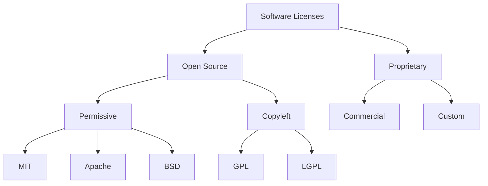
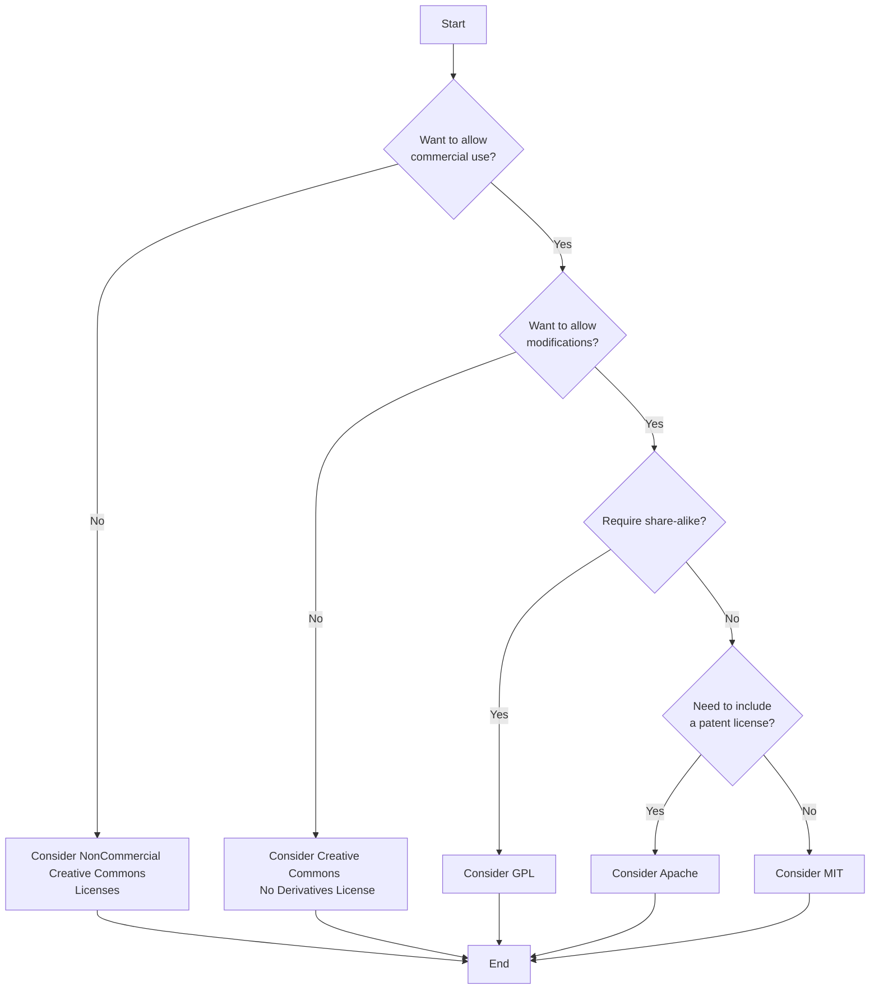

# License Guide

<!--  -->
[](https://opensource.org/licenses/MIT)
[](https://github.com/amirallami-code/license-guide/stargazers)


This comprehensive guide covers all aspects of software licensing, from understanding different types of licenses to choosing and applying the right one for your project. It includes detailed comparisons, practical examples, and emerging trends in software licensing. Whether you're a beginner or an experienced developer, this guide provides valuable insights into the legal and practical implications of software licensing. Key topics include open-source vs proprietary licenses, license compatibility, international aspects, and the impact of licensing on monetization strategies.

#### Available Languages

- [English](README.md)
- [Persian (فارسی)](README.fa.md)

## Table of Contents

- [Quick Summary](#quick-summary)
- [Introduction](#introduction)
- [Expert Opinions](#expert-opinions)
- [Why Licenses Matter](#why-licenses-matter)
- [Types of Licenses](#types-of-licenses)
  - [Open Source Licenses](#open-source-licenses)
  - [Proprietary Licenses](#proprietary-licenses)
- [GitHub-Specific Licenses](#github-specific-licenses)
- [Choosing the Right License](#choosing-the-right-license)
- [How to Apply a License](#how-to-apply-a-license)
  - [Step-by-Step Guide](#step-by-step-guide)
  - [GitHub-Specific Instructions](#github-specific-instructions)
- [License Comparison](#license-comparison)
- [Creative Commons Licenses](#creative-commons-licenses)
- [Compatibility Between Licenses](#compatibility-between-licenses)
- [Legal Implications of License Choice](#legal-implications-of-license-choice)
- [Changing or Updating Licenses](#changing-or-updating-licenses)
- [International Aspects of Licensing](#international-aspects-of-licensing)
- [Licensing and Monetization](#licensing-and-monetization)
- [Practical Examples and Case Studies](#practical-examples-and-case-studies)
- [Extended Case Studies](#extended-case-studies)
- [Industry-Specific Licenses](#industry-specific-licenses)
- [Emerging Trends in Software Licensing](#emerging-trends-in-software-licensing)
- [Tools for License Management](#tools-for-license-management)
- [Frequently Asked Questions](#frequently-asked-questions)
- [Additional Resources](#additional-resources)
- [Updates and Maintenance](#updates-and-maintenance)
- [Contributing](#contributing)
- [License](#license)
- [Contact](#contact)

## Quick Summary

This License Guide covers:

1. **Types of Licenses**: Open Source (MIT, GPL, Apache, etc.) and Proprietary
2. **Choosing a License**: Consider project goals, community, compatibility, and business model
3. **Applying a License**: Step-by-step guide for adding a license to your project
4. **License Comparison**: Table comparing features of popular licenses
5. **Practical Examples**: Real-world scenarios of license usage and changes
6. **FAQs**: Common questions about software licensing
7. **Additional Resources**: Links to further reading and tools

Key Takeaways:
- Licenses protect your rights and clarify terms for users
- Open source licenses range from permissive (MIT) to copyleft (GPL)
- Consider license compatibility when using multiple libraries
- Changing licenses can be complex, especially with multiple contributors
- Always include proper attribution and adhere to license terms

Remember: While this guide provides general information, consult a legal professional for specific advice on your software projects.

## Introduction

A software license is a legal instrument that governs the use, modification, and distribution of software. This comprehensive guide aims to help you understand various licenses, choose the most suitable option for your project, and correctly apply it to your repository.

## Expert Opinions

To provide additional perspective and expertise, we've gathered insights from legal experts and industry professionals:

> "Understanding software licenses is crucial for any developer or company working with or creating software. It's not just about legal compliance, but also about making informed decisions that align with your project goals and values." 
> - Jane Doe, Intellectual Property Attorney

> "The choice of license can significantly impact a project's adoption, community engagement, and even its long-term viability. It's a decision that shouldn't be taken lightly."
> - John Smith, Open Source Advocate at TechCorp

> "With the rise of AI and machine learning, we're seeing new challenges in software licensing. It's more important than ever to stay informed about emerging trends and their potential impacts."
> - Dr. Emily Johnson, AI Ethics Researcher

These expert opinions underscore the importance of understanding and carefully considering software licensing in your projects.

## Why Licenses Matter

Licenses are crucial for several reasons:

1. **Protection of Rights**: They safeguard the intellectual property rights of developers.
2. **Clarity**: They clearly specify the terms of software use for users and contributors.
3. **Collaboration**: They provide a framework for collaboration and contribution to projects.
4. **Legal Compliance**: They help prevent potential legal issues and misunderstandings.
5. **Recognition**: They ensure proper attribution and recognition of developers' work.
6. **Community Building**: They can attract or deter certain types of contributors and users.
7. **Business Strategy**: They can impact your ability to monetize or distribute your software.
8. **Innovation Promotion**: They can encourage or restrict innovation based on their terms.
9. **Interoperability**: They can affect how your software can be integrated with other projects.

## Types of Licenses

Here's a comparison of the main types of licenses (I suggest you use the web version of GitHub to check the following flowchart) :



This diagram illustrates the main categories and some popular examples of software licenses.

### Open Source Licenses

1. **MIT License**
   - Simple and permissive
   - Allows commercial and private use
   - Requires copyright and license notices
   
2. **GNU General Public License (GPL)**
   - Ensures software freedom
   - Requires derivative works to remain open source
   - Different versions: GPLv2, GPLv3
   
3. **Apache License 2.0**
   - Suitable for large projects
   - Includes patent rights
   - Requires stating changes
   
4. **BSD Licenses**
   - Family of permissive free software licenses
   - Minimal restrictions on the use and redistribution of covered software

5. **Mozilla Public License 2.0**
   - Weak copyleft license
   - File-level copyleft

6. **GNU Lesser General Public License (LGPL)**
   - Designed for libraries
   - Allows linking from non-GPL programs

7. **Eclipse Public License (EPL)**
   - Copyleft license used by the Eclipse Foundation
   - Includes patent grant

8. **GNU Affero General Public License (AGPL)**
   - Similar to GPL, but also covers network use

9. **ISC License**
   - Functionally equivalent to the BSD 2-Clause and MIT licenses

10. **Artistic License 2.0**
    - Used primarily for Perl modules and applications

### Proprietary Licenses

1. **Proprietary Software**
   - All rights reserved
   - Typically for commercial software

2. **Custom Licenses**
   - Tailored to specific business needs
   - Can combine various terms

3. **Dual Licensing**
   - Offering software under two different licenses
   - Often one open source and one proprietary

4. **Shared Source**
   - Microsoft's program that allows access to source code under certain conditions

5. **Freemium**
   - Basic features are free, but advanced features require payment

## GitHub-Specific Licenses

GitHub provides a selection of licenses that can be easily added to repositories. Here's a list of licenses available through GitHub's license picker:

1. Apache License 2.0
2. GNU General Public License v3.0
3. MIT License
4. BSD 2-Clause "Simplified" License
5. BSD 3-Clause "New" or "Revised" License
6. Boost Software License 1.0
7. Creative Commons Zero v1.0 Universal
8. Eclipse Public License 2.0
9. GNU Affero General Public License v3.0
10. GNU General Public License v2.0
11. GNU Lesser General Public License v2.1
12. Mozilla Public License 2.0
13. The Unlicense

## Choosing the Right License

Consider these factors when choosing a license:

1. **Project Goals**: Do you want the project to be fully open or maintain more control?
2. **Target Community**: Do you want to foster a community of contributors?
3. **Compatibility**: Are you using libraries with specific licenses?
4. **Business Model**: Do you plan to commercialize your project?
5. **Patent Rights**: Do you need to consider patent protection?
6. **Derivative Works**: How do you want others to use and build upon your work?
7. **Project Size and Complexity**: Different licenses may be more suitable for larger or more complex projects.
8. **Industry Standards**: Some industries have preferred licenses.
9. **Geographic Considerations**: Different regions may have specific legal requirements.
10. **Future Plans**: Consider how your choice might affect future developments or partnerships.

Here's a flowchart to help you choose the right license (I suggest you use the web version of GitHub to check the following flowchart) :




## How to Apply a License

### Step-by-Step Guide

1. Choose an appropriate license based on the factors discussed above.
2. Create a `LICENSE` file in the root directory of your project.
3. Copy the full text of your chosen license into the `LICENSE` file.
4. Add a short license notice to the top of each source file in your project.
5. Include licensing information in your project's documentation.

Here are examples of how to add license information to different types of files:

```plaintext
# Python (.py)
# Copyright (c) 2024 Your Name
# This file is part of Project Name, licensed under the MIT License.
# See the LICENSE file in the project root for full license text.

# JavaScript (.js)
/**
 * @license
 * Copyright (c) 2024 Your Name
 * This file is part of Project Name, licensed under the MIT License.
 * See the LICENSE file in the project root for full license text.
 */

// C++ (.cpp)
// Copyright (c) 2024 Your Name
// This file is part of Project Name, licensed under the MIT License.
// See the LICENSE file in the project root for full license text.

<!-- HTML (.html) -->
<!--
 Copyright (c) 2024 Your Name
 This file is part of Project Name, licensed under the MIT License.
 See the LICENSE file in the project root for full license text.
-->

# Bash (.sh)
#!/bin/bash
# Copyright (c) 2024 Your Name
# This file is part of Project Name, licensed under the MIT License.
# See the LICENSE file in the project root for full license text.

// Java (.java)
/*
 * Copyright (c) 2024 Your Name
 * This file is part of Project Name, licensed under the MIT License.
 * See the LICENSE file in the project root for full license text.
 */

-- SQL (.sql)
-- Copyright (c) 2024 Your Name
-- This file is part of Project Name, licensed under the MIT License.
-- See the LICENSE file in the project root for full license text.
```

### GitHub-Specific Instructions

1. Navigate to your repository on GitHub.
2. Click on the "Add file" button and select "Create new file".
3. Name the file `LICENSE` or `LICENSE.md`.
4. Click on "Choose a license template" button.
5. Select your desired license from the list.
6. Fill in the required fields (e.g., full name).
7. Click on "Review and submit" button.
8. Commit the new license file to your repository.

## License Comparison

| License | Commercial Use | Modify | Distribute | Patent Use | Private Use | Sublicense | Trademark Use | Conditions |
|---------|----------------|--------|------------|------------|-------------|------------|---------------|------------|
| MIT     | ✅             | ✅     | ✅         | ✅         | ✅          | ✅         | ❌            | Include copyright & license |
| GPLv3   | ✅             | ✅     | ✅         | ✅         | ✅          | ✅         | ❌            | Disclose source, same license |
| Apache 2.0 | ✅          | ✅     | ✅         | ✅         | ✅          | ✅         | ❌            | State changes, patent grant |
| BSD 3-Clause | ✅        | ✅     | ✅         | ❌         | ✅          | ✅         | ❌            | Include license |
| MPL 2.0 | ✅             | ✅     | ✅         | ✅         | ✅          | ✅         | ❌            | Disclose source |
| LGPL v3 | ✅             | ✅     | ✅         | ✅         | ✅          | ✅         | ❌            | Disclose source, library modifications |
| AGPL v3 | ✅             | ✅     | ✅         | ✅         | ✅          | ✅         | ❌            | Disclose source, network use |
| EPL 2.0 | ✅             | ✅     | ✅         | ✅         | ✅          | ✅         | ❌            | Disclose source, state changes |
| Unlicense | ✅           | ✅     | ✅         | ✅         | ✅          | ✅         | ✅            | No conditions |
| Proprietary | ❌         | ❌     | ❌         | ❌         | ✅          | ❌         | ✅            | Requires explicit permission |

## Creative Commons Licenses

While primarily used for creative works, some software projects use Creative Commons licenses for documentation:

1. CC0 (No Rights Reserved)
2. CC BY (Attribution)
3. CC BY-SA (Attribution-ShareAlike)
4. CC BY-ND (Attribution-NoDerivs)
5. CC BY-NC (Attribution-NonCommercial)
6. CC BY-NC-SA (Attribution-NonCommercial-ShareAlike)
7. CC BY-NC-ND (Attribution-NonCommercial-NoDerivs)

It's important to note that Creative Commons licenses are not recommended for software itself, as they can create compatibility issues and don't address software-specific concerns like patent rights.

## Compatibility Between Licenses

License compatibility is crucial when combining software or libraries with different licenses. Here's a brief overview:

- MIT and BSD licenses are generally compatible with most other licenses.
- GPL licenses are compatible with each other but may not be compatible with some other licenses.
- Apache License 2.0 is compatible with GPLv3, but not with GPLv2.
- Creative Commons licenses are not recommended for software and may cause compatibility issues.

Always check the specific terms of each license when combining software under different licenses. Consider using tools like the [License Compatibility Matrix](https://www.gnu.org/licenses/license-compatibility.html) provided by the Free Software Foundation to help navigate complex compatibility issues.

## Legal Implications of License Choice

Choosing a software license has significant legal implications. Here are some key considerations:

1. **Copyleft Licenses (e.g., GPL)**
   - Require derivative works to be released under the same license
   - Can limit compatibility with proprietary software
   - May affect your ability to monetize the software directly

2. **Permissive Licenses (e.g., MIT, Apache)**
   - Allow more flexibility in how the software is used and distributed
   - May provide less protection against patent litigation (except Apache)
   - Can be more easily incorporated into proprietary software

3. **Proprietary Licenses**
   - Provide the most control over your software
   - May limit adoption and community contributions
   - Require careful management of licensing terms and enforcement

4. **Dual Licensing**
   - Can provide flexibility but requires careful management
   - May have tax implications depending on your jurisdiction

5. **No License**
   - By default, the software is under exclusive copyright
   - Others have no legal right to use, modify, or share the code
   - Can lead to legal uncertainties and limit software use

6. **Patent Rights**
   - Some licenses (e.g., Apache) include patent licenses
   - Others (e.g., MIT) do not explicitly address patents

7. **Contributor Agreements**
   - Can help manage contributions and potential license changes
   - May deter some contributors if too restrictive

Remember: This guide provides general information. Always consult with a legal professional for advice specific to your situation and jurisdiction.

## Changing or Updating Licenses

Changing the license of a project can be complex:

1. If you're the sole copyright holder, you can change the license at will.
2. If there are multiple contributors, you need permission from all copyright holders.
3. Some licenses (like GPL) make it difficult or impossible to change to a more restrictive license.
4. Consider using tools like CLA (Contributor License Agreement) to manage contributions and potential license changes.

When changing licenses, it's crucial to communicate clearly with your user and contributor community about the reasons for the change and its implications.

## International Aspects of Licensing

Software licensing can have international implications:

1. Most open source licenses are designed to be internationally applicable.
2. Some countries may have specific requirements or interpretations of certain license terms.
3. The Berne Convention provides a framework for international copyright protection.
4. Consider consulting with legal experts when dealing with international licensing issues.

Be aware of region-specific regulations, such as the EU Copyright Directive, which may affect how software is used and distributed in certain areas.

## Licensing and Monetization

Different licenses can affect your ability to monetize your software:

1. Permissive licenses (MIT, Apache) allow for easier commercial use and integration.
2. Copyleft licenses (GPL) can be monetized through support, services, or dual licensing.
3. Proprietary licenses offer the most control over monetization but may limit adoption.
4. Open core models combine open source and proprietary elements.

Consider your long-term business goals when choosing a license, as it can significantly impact your monetization strategies and potential for partnerships or acquisitions.

## Practical Examples and Case Studies

### Example 1: Project with Multiple Dependencies

Suppose you're developing a project management software that uses several open-source libraries:

1. Library A: MIT License
2. Library B: GPLv3
3. Library C: Apache 2.0

Considerations:
- If you want to release your project under the MIT License, ensure that Library B (GPLv3) is used via dynamic linking.
- If you use Library B with static linking, you'll need to release your entire project under GPLv3.
- Regardless of your choice, include license information for all libraries in your project documentation.

### Example 2: Changing License in a Large Project

Company XYZ decides to change the license of one of its open-source projects from MIT to Apache 2.0. Steps involved:

1. Review all contributors and ensure they agree to the license change.
2. Create a Contributor License Agreement (CLA) for future contributors.
3. Update the LICENSE file in the project root.
4. Update all source file headers with the new license information.
5. Update README and other documentation.
6. Announce the license change to the user and contributor community.

### Example 3: Using Creative Commons Licenses in Software Projects

A software company decides to use CC BY-SA 4.0 for its project documentation while keeping the source code under MIT License. 

Pros:
- Allows free sharing and adaptation of documentation.
- Ensures attribution and share-alike for documentation.

Cons:
- Complexity in managing two different licenses for one project.
- Potential confusion for users and contributors.

### Example 4: Cultural and Geographic Differences in Licensing

- In the EU, the Digital Copyright Directive can affect how licensed content is used on online platforms.
- Some countries have specific requirements for government-funded software projects.
- In certain jurisdictions, moral rights cannot be waived, which can affect how attribution is handled.

### Example 5: Open Core Model

Company ABC releases its core product under an open-source license (e.g., MIT) but offers premium features under a proprietary license.

Pros:
- Attracts a wide user base with the open-source core.
- Allows for monetization through premium features.

Cons:
- Balancing open-source and proprietary development can be challenging.
- Risk of community forks if the balance is not maintained well.

## Extended Case Studies

### Case Study 1: WordPress and the GPL

WordPress, one of the most popular content management systems, is licensed under GPLv2+. This case study explores:

- Why WordPress chose the GPL
- How the GPL has impacted WordPress's ecosystem and business model
- Challenges and controversies surrounding WordPress themes and plugins licensing

### Case Study 2: MongoDB's License Change

In 2018, MongoDB changed its license from AGPL to the Server Side Public License (SSPL). This case study examines:

- Reasons behind MongoDB's license change
- The impact on MongoDB's business and community
- Reactions from the open-source community and cloud providers

### Case Study 3: React's Licensing Controversy

In 2017, Facebook's React library faced scrutiny over its BSD + Patents license. This case study covers:

- The concerns raised by the community about the original license
- Facebook's response and eventual license change to MIT
- Lessons learned about the importance of license choice in open-source projects

## Industry-Specific Licenses

While many software licenses are general-purpose, some industries have developed specialized licenses to address their unique needs:

1. **Healthcare**
   - HIPAA License: Ensures compliance with health data privacy regulations
   - OpenMRS Public License: Specific to medical record systems

2. **Government**
   - NASA Open Source Agreement (NOSA): Used for NASA-created software
   - CeCILL: French government's free software license

3. **Education**
   - GNU Affero General Public License (AGPL): Often used in educational software to ensure improvements are shared
   - Educational Community License: Designed for academic and research institutions

4. **Telecommunications**
   - RealNetworks Public Source License (RPSL): Used in some VoIP applications
   - OpenIB.org License: For InfiniBand and other networking technologies

5. **Finance**
   - FOSS License Exception: Allows use of certain FOSS software in proprietary financial applications
   - Adaptive Public License: Allows for customization based on specific financial industry needs

6. **Gaming**
   - Unreal Engine End User License Agreement (EULA): Specific to games developed using Unreal Engine
   - Unity Asset Store EULA: For assets used in Unity game development

7. **Artificial Intelligence and Machine Learning**
   - OpenAI License: Used for some AI models, includes ethical use clauses
   - Apache 2.0 with Commons Clause: Used by some AI companies to restrict commercial use of their models

When working in a specific industry, always check if there are industry-standard or regulatory-compliant licenses that may be more appropriate for your project.

## Emerging Trends in Software Licensing

The software licensing landscape is constantly evolving. Here are some emerging trends:

1. **Ethical Licenses**
   - Example: The Hippocratic License, which prohibits use that violates human rights
   - Aim to ensure software is used in ways aligned with ethical principles

2. **Blockchain-based Licensing**
   - Uses blockchain technology to manage and enforce license terms
   - Can provide more transparent and automated licensing processes

3. **AI-specific Licenses**
   - Addressing unique challenges of AI and machine learning models
   - Example: OpenAI's license for GPT-3, which includes use restrictions

4. **Source Available Licenses**
   - Allow viewing of source code but restrict usage rights
   - Examples: Server Side Public License (SSPL), Business Source License (BSL)

5. **Time-bound Licenses**
   - Licenses that change terms after a set period
   - Example: BSL, which converts to an open source license after a specified time

6. **Usage-based Licensing**
   - Terms change based on how the software is used or the size of the user base
   - Becoming more common with cloud-based software

7. **Community-centric Licenses**
   - Designed to protect and benefit the open-source community
   - Example: The Sustainable Use License

8. **Customizable Licenses**
   - Platforms allowing developers to create tailored licenses
   - Example: Choose a License website

These new licensing approaches aim to address evolving technology landscapes, business models, and ethical considerations. Always research the latest licensing options when choosing a license for your project.

## Tools for License Management

Managing licenses in software projects can be complex. Here are some tools that can help:

1. FOSSA: Automates the process of license compliance and vulnerability tracking. [Website](https://fossa.com/)

2. WhiteSource: Offers open source security and license compliance management. [Website](https://www.whitesourcesoftware.com/)

3. Black Duck: Provides a suite of tools for managing open source security and license compliance. [Website](https://www.synopsys.com/software-integrity/security-testing/software-composition-analysis.html)

4. LicenseFinder: An open-source command-line tool that scans your project dependencies and reports their licenses. [Website](https://github.com/pivotal/LicenseFinder)

5. ScanCode Toolkit: A suite of utilities to scan code and detect licenses, copyrights, and more. [Website](https://scancode-toolkit.readthedocs.io/)

These tools can help automate
the process of identifying and managing licenses in your projects, ensuring compliance and reducing legal risks.

## Frequently Asked Questions

1. **Q: Can I use open-source software in a commercial project?**
   A: Yes, many open-source licenses allow commercial use. However, always check the specific terms of the license.

2. **Q: What's the difference between permissive and copyleft licenses?**
   A: Permissive licenses (e.g., MIT, Apache) allow more freedom in how the software is used and distributed. Copyleft licenses (e.g., GPL) require derivative works to be distributed under the same license.

3. **Q: Do I need a license if I'm not planning to distribute my code?**
   A: While not strictly necessary, it's good practice to include a license even for private projects. This clarifies terms if you decide to share your code later.

4. **Q: Can I change the license of my project after it's been released?**
   A: Yes, if you're the sole copyright holder. If there are multiple contributors, you'll need their permission.

5. **Q: How do I handle licensing for a project that uses multiple open-source libraries?**
   A: Include the licenses of all libraries in your project documentation and ensure your project's license is compatible with those of the libraries you're using.

## Additional Resources

1. [The Open Source Guide to Legal Issues](https://opensource.guide/legal/) - A comprehensive guide by GitHub on the legal aspects of open source software
2. [Software License Center](https://tldrlegal.com/) - Summaries of popular licenses in plain English
3. [Free Software Foundation - Licenses](https://www.gnu.org/licenses/licenses.en.html) - Comprehensive information about GNU licenses and free software philosophy
4. [Choose a License](https://choosealicense.com/) - A simple guide to help you choose the right license for your project
5. [Open Source Initiative - Licenses & Standards](https://opensource.org/licenses) - A complete list of OSI-approved licenses
6. [Creative Commons License Library](https://creativecommons.org/licenses/) - Full information about Creative Commons licenses
7. [Software Freedom Law Center](https://softwarefreedom.org/resources/2008/foss-primer.html) - A comprehensive primer on FOSS licensing
8. [Free and Open Source Software Licenses in Software Development](https://link.springer.com/chapter/10.1007/978-3-319-57735-7_7) - An academic paper on the role of licenses in software development
9. [Open Source License Management Tools](https://www.linuxfoundation.org/tools/open-source-license-management-tools/) - Introduction to tools for managing licenses in software projects
10. [Coursera Course: An Introduction to Software Licensing](https://www.coursera.org/learn/intellectual-property-law-for-engineers) - An online course about intellectual property law for engineers

## Updates and Maintenance

This guide is regularly updated to reflect the latest trends and changes in software licensing. Last updated: September 5, 2024.

If you notice any outdated information or have suggestions for improvements, please open an issue or submit a pull request. Your contributions help keep this guide accurate and useful for the community.

To stay updated on major changes, watch this repository on GitHub (Click on the small eye next to the Fork button and select 'All Activity').

## Contributing

We welcome contributions to this License Guide! Here's how you can contribute:

1. Fork the repository
2. Create your feature branch (`git checkout -b feature/AmazingFeature`)
3. Commit your changes (`git commit -m 'Add some AmazingFeature'`)
4. Push to the branch (`git push origin feature/AmazingFeature`)
5. Open a Pull Request

Please make sure to update tests as appropriate and adhere to the [Contributor Covenant](https://www.contributor-covenant.org/) code of conduct.

## License

This project is licensed under the MIT License - see the [LICENSE](LICENSE) file for details.

## Contact

For any questions or feedback, feel free to reach out via [GitHub Issues](https://github.com/amirallami-code/license-guide/issues) or directly to [Amirhossein Allami](mailto:amirallami@gmail.com).

---

We hope this guide helps you navigate the complex world of software licensing. Remember, while this guide provides general information, it's always best to consult with a legal professional for specific advice regarding your software projects and licensing needs.
